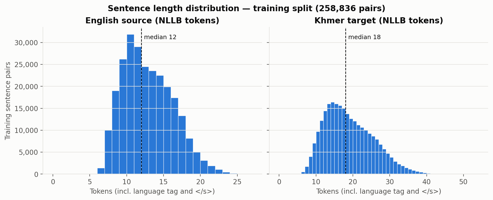
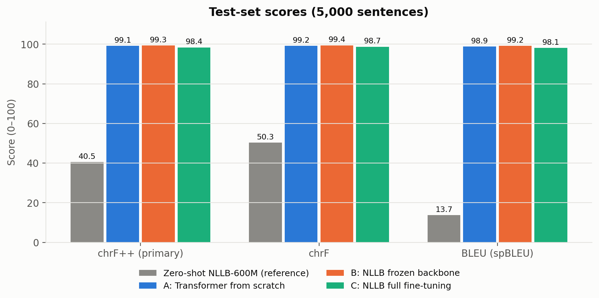
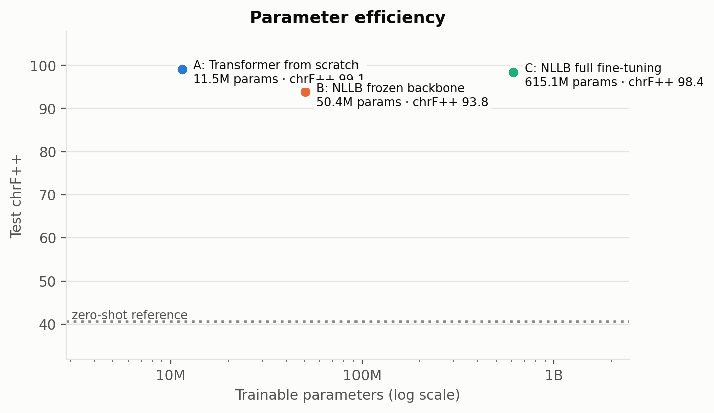
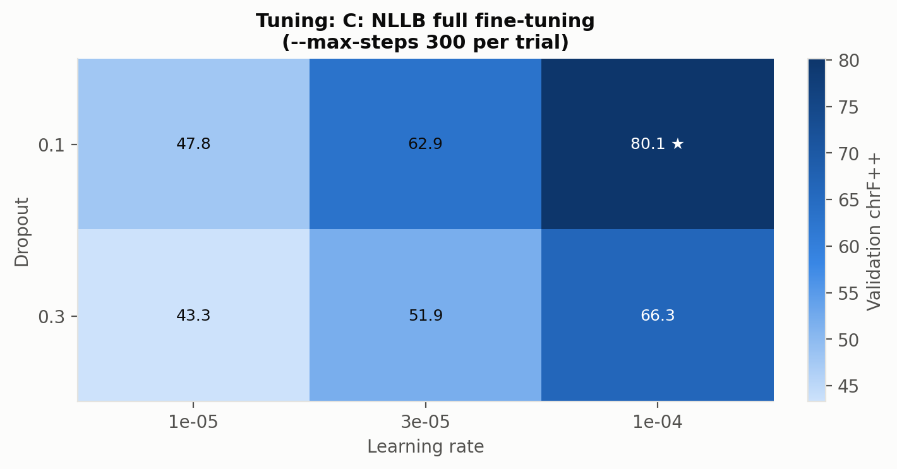
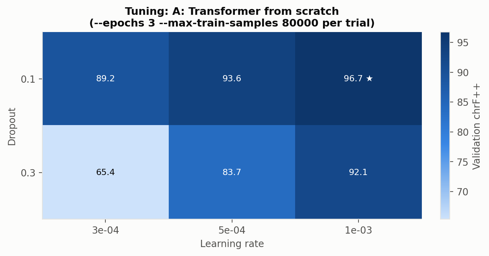
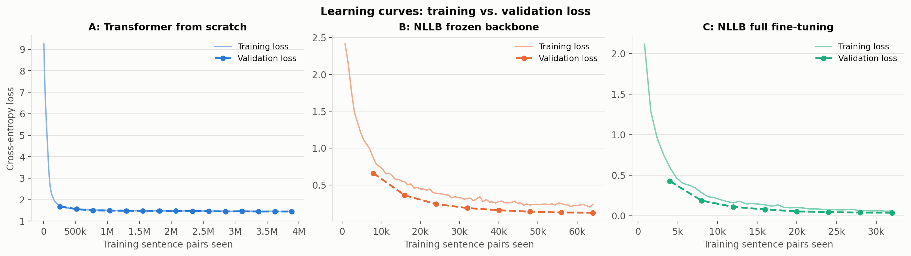
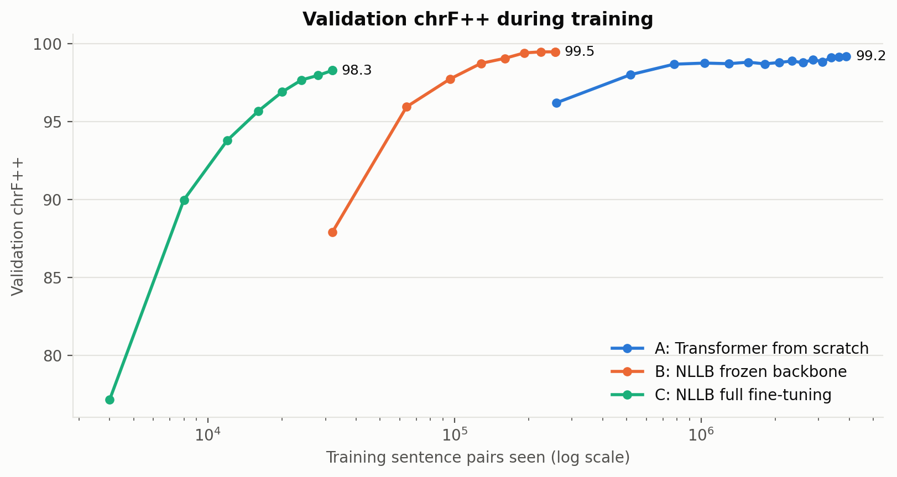
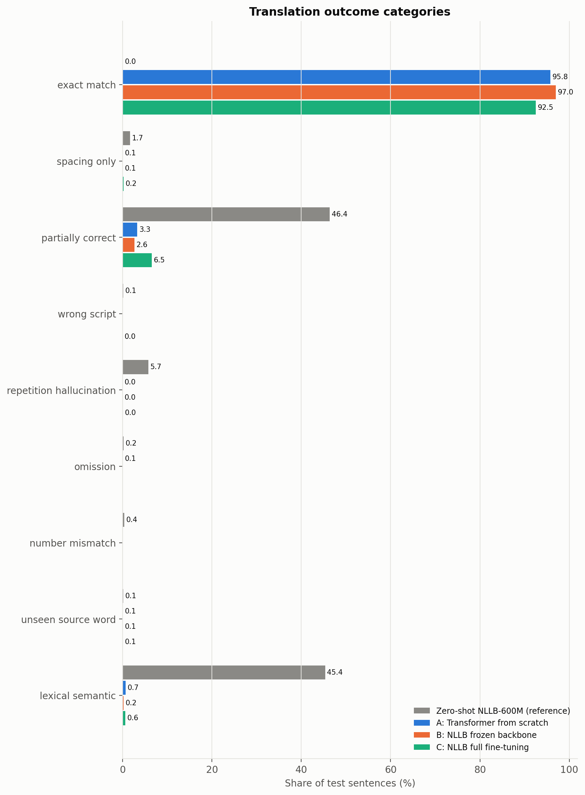
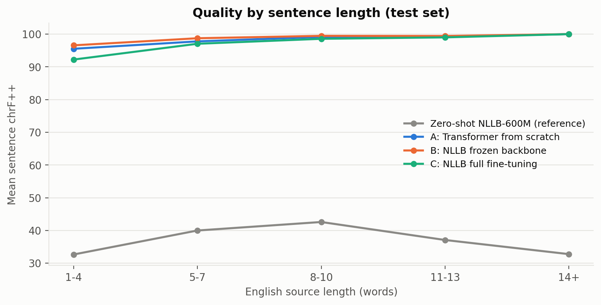

# English → Khmer Neural Machine Translation: From Scratch vs. Frozen Backbone vs. Full Fine-Tuning

**Author:** _‹Lav Vimean›_ ([@VimeanLav](https://github.com/VimeanLav))  
**Course:** Deep Learning, Final Project (individual) · Bachelor of Software Engineering, Department of Engineering, Kirirom Institute of Technology  
**Lecturer:** Mr. Soklong HIM · **Academic year:** 2026–2027

This project trains and compares **three deep-learning approaches** to translating English sentences into Khmer, all on the **same data split, the same test sentences and the same metrics**:

| | Approach | Distinct by (rubric §4) | Trainable params |
|---|---|---|---|
| **A** | Transformer encoder-decoder **trained from scratch** | training strategy (random init) + architecture (small model, own vocabulary) | 11.5M |
| **B** | NLLB-200-distilled-600M, **frozen backbone** (only decoder cross-attention trained) | training strategy (transfer learning, frozen backbone) | 50.4M (8.2%) |
| **C** | NLLB-200-distilled-600M, **full fine-tuning** | training strategy (transfer learning, all weights) | 615.1M |
| ref. | Zero-shot NLLB-200-distilled-600M | *reference only*: not trained, so not counted as an approach (rubric §2) | 0 |

> **Headline result.** On the same 5,000 held-out test sentences, all three trained approaches far exceed the zero-shot reference (chrF++ 40.5).
> - **B, the frozen backbone, scores highest** (chrF++ **99.31**) while training only 8.2% of NLLB's parameters for one epoch.
> - **A, the scratch model**, follows closely (**99.13**).
> - **C, full fine-tuning**, reaches **98.42** from about 8–120× fewer training examples than the others.
>
> The test set is in-domain and highly templated, and A generalises poorly outside it (§9, §10). Every number in this report is produced by the code in this repository and saved under [`results/`](results/).

---

## Contents
1. [Problem statement](#1-problem-statement)
2. [Dataset](#2-dataset)
3. [Approaches](#3-approaches)
4. [Experimental setup](#4-experimental-setup)
5. [Results](#5-results)
6. [Hyperparameter tuning](#6-hyperparameter-tuning)
7. [Learning curves](#7-learning-curves-over--underfitting)
8. [Error analysis](#8-error-analysis)
9. [Discussion: why the best approach wins](#9-discussion-why-the-best-approach-wins)
10. [Limitations and future work](#10-limitations-and-future-work)
11. [How to reproduce](#11-how-to-reproduce)
12. [Repository structure](#12-repository-structure)
13. [Model weights](#13-model-weights)
14. [References](#14-references)
15. [AI use disclosure](#15-ai-use-disclosure)

---

## 1. Problem statement

**Task:** sentence-level machine translation, a **sequence-to-sequence generation** problem.

- **Input:** one English sentence (Latin script), e.g. `I want to eat papaya salad.`
- **Output:** its Khmer translation (Khmer script), e.g. `ញុមចង់ញ៉ាំបុកល្ហុង។`

**Why it matters.** Khmer is spoken by about 17 million people but is a *low-resource* language for NLP: there is little parallel text, and the script is written **without spaces between words**. Good English→Khmer translation helps Cambodian users access information, and comparing training strategies shows how much a small team can gain from large multilingual pretrained models versus training its own model.

**Research question.** With a fixed, modest compute budget (a free Colab T4 or an 8 GB laptop GPU), which strategy translates English→Khmer best: training a small Transformer from scratch, adapting only part of a large pretrained model, or fine-tuning all of it? And at what cost in parameters and training time?

## 2. Dataset

| Property | Value |
|---|---|
| Source | [`SeyhaLite/Translate-English-Khmer-All`](https://huggingface.co/datasets/SeyhaLite/Translate-English-Khmer-All) (Hugging Face Hub) |
| License | Apache-2.0 |
| Content | English–Khmer sentence pairs aggregated from several domains, per the dataset card (daily conversation, business, technology, medical, legal) |
| Raw size | 366,174 pairs |
| After cleaning | **323,545 pairs** (42,629 removed, 11.6%) |
| Split (seed 42) | **80 / 10 / 10**: train 258,836 · validation 32,354 · test 32,355 |
| Test set used for the comparison | the first **5,000** test pairs, identical for every approach (see §4) |

All numbers in this section are produced by `python -m src.data_stats` → [`results/data_stats.json`](results/data_stats.json).

**Preprocessing** (`src/data.py`, applied once before splitting, identical for all approaches):
1. Strip whitespace, and drop pairs with an empty side.
2. **Remove duplicate English sentences** (keep the first). This guarantees that no English test sentence also appears in training.
3. Shuffle and split 80/10/10 with a fixed seed.
4. Tokenize with the NLLB tokenizer (`src_lang=eng_Latn`, `tgt_lang=khm_Khmr`), truncating to 128 tokens. No sentence is actually truncated: the longest has 26 source / 53 target tokens. Padding is per batch (`--dynamic-padding`).

Approach A cannot use NLLB's vocabulary, so it trains its own SentencePiece tokenizer on the **training split only**. Every approach receives the same raw English test sentences and is scored against the same raw Khmer references.

**Length distribution.** Sentences are short (English: mean 7.4 words, max 17; Khmer: mean 40.5 characters).



**Known biases and noise.**
- **Narrow, templated language.** The whole English training vocabulary is only **4,102 words**, and many sentences follow templates (`Listen, My aunt is happy.`, `Look, I went to the temple yesterday.`). Only **0.1%** of test sentences contain an English word unseen in training. Scores on this test set therefore measure in-domain performance and will overestimate quality on real-world text.
- **Overlap.** After removing duplicate English sentences, 0.05% of test sources are still near-duplicates of a training source (differing only in case or punctuation), and **3.1%** of test references occur verbatim as a training reference.
- **Inconsistent Khmer spacing.** Khmer does not need spaces between words, but 73% of references contain spaces and 27% have none, so spacing is not a reliable signal. This is why chrF (whitespace-insensitive) is reported next to chrF++.
- **Informal spelling.** Many references use colloquial forms (e.g. `ញុម` for `ខ្ញុំ` "I"), so a correct formal translation can be scored as wrong.
- **Single reference** per sentence, of unknown translation provenance.

## 3. Approaches

### A: Transformer from scratch (`src/model_scratch.py`, `src/train_scratch.py`)
A standard encoder-decoder Transformer (Vaswani et al., 2017), implemented with PyTorch `nn.TransformerEncoder` / `nn.TransformerDecoder`:
- 4 encoder + 4 decoder layers, `d_model` 256, 4 heads, feed-forward 1024, dropout 0.1, pre-layer-norm (more stable when training from scratch).
- A joint English+Khmer **SentencePiece unigram vocabulary of 16,000 pieces**, trained on the training split only.
- Shared input/output embeddings (weight tying) and sinusoidal positional encodings.
- **11.5M parameters, all trainable, randomly initialised.**
- Hand-written training loop: AdamW (β = 0.9/0.98), linear warmup + linear decay, label smoothing 0.1, fp16 mixed precision, gradient clipping 1.0, batch 128, up to 15 epochs with **early stopping** on validation chrF++ (patience 3).
- Decoding: batched beam search, implemented in `Seq2SeqTransformer.generate`.

*Why:* the no-transfer baseline. It shows what the data alone can teach a model with a strong inductive bias for sequence transduction, but no prior language knowledge.

### B: NLLB with a frozen backbone (`src/train_frozen.py`)
[NLLB-200-distilled-600M](https://huggingface.co/facebook/nllb-200-distilled-600M) is a 615M-parameter multilingual Transformer pretrained on 200 languages, including Khmer. **Everything is frozen except the 12 decoder cross-attention blocks** (and their layer norms), which is 50.4M parameters (8.2%). Cross-attention is the only place where the decoder reads the encoded English sentence, so adapting it retargets the source–target alignment while keeping the pretrained language knowledge fixed. The output layer is **not** unfrozen: NLLB ties it to the 256k-token embedding matrix (262M parameters), so training it would also change every input embedding.
- AdamW, lr 1e-4, dropout 0.1, weight decay 0.01, linear warmup (10%) + decay, fp16, effective batch 16 (8 × 2 accumulation), **16,000 steps**. That is 256k sentence pairs, about one epoch.
- The first run used 4,000 steps (64k pairs). Its validation chrF++ was still rising at the end (§7), so B was retrained with a 4× budget. The 4,000-step run is kept as an ablation (§6, [`results/ablations/frozen_4000_steps/`](results/ablations/frozen_4000_steps/)).

*Why:* parameter-efficient transfer learning, the translation analogue of a "linear probe / frozen backbone".

### C: NLLB full fine-tuning (`src/train_finetune.py`)
The same pretrained model with **all 615.1M parameters trainable**.
- Full fine-tuning with AdamW would need about 9.8 GB of GPU memory: fp32 weights + gradients + two moment buffers, 615M × 16 bytes. That exceeds the 8 GB target, so C uses **Adafactor** (factored second moments) + **gradient checkpointing** + fp16. Measured peak: **6.6 GB**.
- lr **1e-4** (tuned, §6; the script default is 2e-5), dropout 0.1, weight decay 0.01, linear warmup (10%) + decay, effective batch 16, 2,000 steps.

*Why:* maximum capacity to adapt to the domain, at the highest compute and memory cost.

### Reference: zero-shot NLLB
The pretrained model used as-is with the `khm_Khmr` target tag. It shows what pretraining alone achieves, and therefore how much each approach's training adds.

## 4. Experimental setup

**Metrics** (`src/utils/metrics.py`, via sacreBLEU):
| Metric | Role | Why |
|---|---|---|
| **chrF++** | **primary** | Character n-gram F-score plus word 1–2-grams. Character-level matching suits Khmer, which has no reliable word boundaries. It is the standard metric for FLORES-200 / NLLB. |
| chrF | secondary | Character-only and whitespace-insensitive, so it is unaffected by inconsistent Khmer spacing. |
| BLEU (spBLEU) | secondary | BLEU on SentencePiece pieces (sacreBLEU `flores200` tokenizer), as reported in the NLLB paper. Word-level BLEU is meaningless for unsegmented Khmer. |

**Evaluation protocol: identical for every approach** (`src/evaluate.py`):
- The same **5,000 held-out test sentences** (the first 5,000 of the shuffled, fixed test split; `TEST_EVAL_SIZE` in `src/config.py`). Pass `--max-samples -1` for all 32,355.
- The same decoding: **beam search with 4 beams**, at most 128 new tokens.
- The test set is used **only for final numbers**. Checkpoint selection, early stopping and hyperparameter tuning all use the **validation** set (the first 1,000 validation sentences during training, 500 per tuning trial).
- The single exception is B, which was scored on the test set twice: once for the 4,000-step run (kept as an ablation) and once for the final 16,000-step run. The decision to train B longer was based on its **validation** curve still rising, not on its test score.

**Training budget.** Budgets are fixed so that the whole project fits in a few hours on a free Colab T4 (rubric §3.3):
| | Batch (pairs/step) | Budget | GPU | s/step | Train time | Wall time incl. validation + checkpoints |
|---|---|---|---|---|---|---|
| A | 128 | 15 epochs (3.88M pairs), early-stopping patience 3 (not triggered) | Tesla T4 | 0.043 | 21.8 min | 23.9 min |
| B | 16 | 16,000 steps (256k pairs ≈ 1 epoch) | RTX 4070 Laptop | 0.231 | 61.6 min | 75.0 min |
| B (ablation) | 16 | 4,000 steps (64k pairs) | Tesla T4 | 0.202 | 13.5 min | 25.8 min |
| C | 16 | 2,000 steps (32k pairs) | Tesla T4 | 0.826 | 27.5 min | 37.7 min |

"Train time" counts optimizer steps only. Tuning added 6 trials × ~1.3 min for A and 6 × ~4.1 min for C. Source: `results/<approach>_train_summary.json` and `results/tuning/*_trials.csv`.

**Reproducibility.**
- Seeds: `src/utils/seed.py` seeds Python `random`, NumPy, `torch.manual_seed` and all CUDA devices. Every script calls it, and the data split, data order and SentencePiece model are all deterministic.
- Versions: exact package versions are pinned in `requirements.txt`, and every run logs its hardware and library versions.
- Checkpointing:
  - A: after every epoch, `torch.save` writes a full checkpoint (model, optimizer, scheduler, grad-scaler and RNG states). The write is atomic (temp file + rename), and `torch.load` restores it with `--resume`. The best weights are saved with `torch.save(model.state_dict())`.
  - B and C: the Hugging Face `Trainer` checkpoints every 500–1,000 steps (optimizer, scheduler and RNG states via `torch.save`, weights via safetensors) and resumes with `--resume`.
  - Training-time totals are also saved with each checkpoint, so reported times stay correct across Colab disconnects.

**Hardware.** Each run's hardware is logged in its `results/<approach>_train_summary.json`.
- **A, C and B's 4,000-step ablation** ran on Google Colab with an **NVIDIA Tesla T4** (14.6 GB): Python 3.13.15, PyTorch 2.11.0, CUDA 12.8.
- **B's final 16,000-step run** ran locally on an **NVIDIA RTX 4070 Laptop GPU** (8 GB, 55 W power limit), with the same PyTorch and CUDA versions. The Colab free-tier GPU quota had been used up.
- The scores do not depend on the GPU, but the timings do. On identical B steps the laptop took about 14% longer per step than the T4 (0.231 vs 0.202 s/step).
- Development and smoke tests also used the RTX 4070 Laptop GPU, on Windows 11.

## 5. Results

Generated by `python -m src.compare` ([`results/comparison.md`](results/comparison.md), [`results/comparison.csv`](results/comparison.csv)):

| Approach | chrF++ ↑ | chrF ↑ | BLEU ↑ | Trainable / total params | Train steps | Pairs seen | Train time | s / step | Peak VRAM | Test inference (5,000 sent.) |
|---|---:|---:|---:|---:|---:|---:|---:|---:|---:|---:|
| Zero-shot NLLB-600M (reference) | 40.53 | 50.31 | 13.69 | 0 / 615.1M | – | – | – | – | – | – |
| A: Transformer from scratch | 99.13 | 99.16 | 98.86 | 11.5M / 11.5M | 30,345 | 3.88M | 0:21:45 | 0.043 | 1.63 GB | 8 s |
| **B: NLLB frozen backbone** | **99.31** | **99.45** | **99.21** | 50.4M / 615.1M | 16,000 | 256k | 1:01:34 † | 0.231 † | 5.18 GB | 152 s † |
| C: NLLB full fine-tuning | 98.42 | 98.71 | 98.09 | 615.1M / 615.1M | 2,000 | 32k | 0:27:32 | 0.826 | 6.66 GB | 149 s |
| *B, 4,000-step ablation* | *93.82* | *94.59* | *90.38* | *50.4M / 615.1M* | *4,000* | *64k* | *0:13:27* | *0.202* | *5.18 GB* | *222 s* |

*Same 5,000 held-out test sentences for every approach, with beam search (4 beams). BLEU is spBLEU (sacreBLEU `flores200` tokenizer). "Pairs seen" = steps × batch size. Train time counts optimizer steps only. † measured on the RTX 4070 Laptop GPU; all other timings are on a Tesla T4 (§4). The zero-shot row re-scores translations from an earlier run of the same model on the same sentences (`--from-predictions`), so it has no inference time.*

**Comparison figures** (generated by `python -m src.plots`):




**Summary.**
- **Training matters enormously.** Every trained approach far exceeds zero-shot NLLB (+58 to +59 chrF++).
- **B (frozen backbone) has the best scores** (99.31 chrF++, 99.21 BLEU) after one epoch, while updating only 8.2% of NLLB's parameters. The top three are close: B leads A by 0.18 chrF++ and C by 0.89.
- **Budget decided B's result.** With a quarter of the data (4,000 steps, 64k pairs), B scored only 93.82. Training 4× longer added **+5.5 chrF++** and **+8.8 BLEU**, confirming that the first run was undertrained (§7).
- **C learns fastest from data.** It reached 98.42 after only **32k sentence pairs**: 8× fewer than B and about 120× fewer than A (3.88M pair-passes over 15 epochs).
- **A is the cheapest to run.** Translating the test set took 8 s, against about 150 s for the 615M-parameter NLLB models.

## 6. Hyperparameter tuning

`python -m src.tune` runs a grid search over **learning rate × dropout** (dropout is the regularization choice), scoring each short trial by **validation** chrF++. Every trial is appended to `results/tuning/<approach>_trials.csv`, and the best configuration (`<approach>_best.json`) is then used for the final training run.

| Approach | Learning rates | Dropout | Budget per trial | Trials |
|---|---|---|---|---|
| A (scratch) | 3e-4, 5e-4, 1e-3 | 0.1, 0.3 | 3 epochs on an 80k-pair subset | 6 |
| C (full FT) | 1e-5, 3e-5, 1e-4 | 0.1, 0.3 | 300 steps | 6 |
| B (frozen, optional) | 3e-5, 1e-4, 3e-4 | 0.1, 0.3 | 500 steps | 6 |




Approach B was not tuned and uses its defaults (lr 1e-4, dropout 0.1).

**Results** (validation chrF++; weight decay fixed at 0.01; source `results/tuning/*_trials.csv`):

| Learning rate → | **A** 3e-4 | **A** 5e-4 | **A** 1e-3 | | **C** 1e-5 | **C** 3e-5 | **C** 1e-4 |
|---|---:|---:|---:|---|---:|---:|---:|
| dropout 0.1 | 89.17 | 93.59 | **96.73** ★ | | 47.78 | 62.89 | **80.14** ★ |
| dropout 0.3 | 65.36 | 83.67 | 92.07 | | 43.28 | 51.88 | 66.26 |

**Findings**
- **Best configurations:** A uses lr = 1e-3 with dropout = 0.1, and C uses lr = 1e-4 with dropout = 0.1. These were used for the final runs. C's tuned learning rate is 5× the common fine-tuning default of 2e-5.
- **Learning rate:** in both grids, higher was better, and the best value is at the **upper edge** of the grid. The true optimum may therefore be higher. That is a limitation of this grid.
- **Regularization:** dropout 0.3 was **always worse** than 0.1, by 4.5 to 23.8 chrF++. Under these short budgets the models are still **underfitting**, so extra regularization only slows learning, and there is no overfitting for it to counteract.
- **Caveat:** short trials favour settings that converge quickly (high learning rate, low dropout). With much longer training the ranking could change (§10).

**Training-budget ablation (approach B).** B's first run was stopped at 4,000 steps while its validation curve was still rising, so it was retrained from scratch with a 4× budget. Everything else was kept the same (lr 1e-4, dropout 0.1, 10% warmup). Source: [`results/ablations/frozen_4000_steps/`](results/ablations/frozen_4000_steps/) vs. `results/frozen_*`.

| B budget | Pairs seen | Best val chrF++ | Test chrF++ | Test BLEU | Exact matches |
|---|---:|---:|---:|---:|---:|
| 4,000 steps | 64k | 93.36 | 93.82 | 90.38 | 75.1% |
| **16,000 steps** | **256k** | **99.48** | **99.31** | **99.21** | **97.0%** |

The model's capacity was not the bottleneck: the frozen backbone was simply undertrained. The budget (the number of training steps, which the rubric counts as a hyperparameter) had a larger effect than any learning-rate or dropout setting.

## 7. Learning curves: over- / underfitting




**None of the three approaches overfits.** In every run, validation loss falls alongside training loss and never rises.

- **A (scratch):** training loss falls from 9.3 to about 1.5 within the first epoch (~260k pairs). Validation loss then decreases slowly, from 1.68 to 1.45, through epoch 15. Validation chrF++ still improved at the last epoch (99.19), so early stopping never triggered (`best_epoch` = 15). A is converging but not overfitting. Its loss levels off near 1.45 rather than 0 because of **label smoothing (0.1)**. For the same reason, A's loss values are not comparable with B's and C's, which have no label smoothing.
- **B (frozen backbone):**
  - In the first, 4,000-step run, validation chrF++ was **still rising at the end** (93.4), a sign of **underfitting / too small a budget**. This motivated the longer run.
  - In the final 16,000-step run, validation loss falls from 0.23 to 0.017, and chrF++ rises from 87.9 to **99.48**. It **plateaus over the last 4,000 steps** (99.41 → 99.48 → 99.48), so B has now converged, with no sign of overfitting.
  - Its validation loss sits below the training loss because dropout is active only during training, and each logged training loss is an average over the preceding 50 steps.
- **C (full fine-tuning):** validation loss falls from 0.43 to 0.036, and chrF++ rises from 77 to 98.3, flattening over the last 500 steps. C is close to converged within its budget, with no overfitting.
- **Sample efficiency** (`val_chrf_curves.png`, log scale):
  - C reaches **90.0** chrF++ after **8k** training pairs and 93.8 after 12k.
  - B, in the 16k-step run, is at 87.9 after 32k pairs, 96.0 after 64k and 99.5 after 256k. Its early points are lower partly because the longer schedule warms up for 1,600 steps.
  - A is already at 96.2 after its first epoch, but that is **259k** pairs.
  - So **C learns the most per training example, B reaches the highest final score, and A needs by far the most data.**

## 8. Error analysis

`python -m src.error_analysis` scores every test sentence with sentence-level chrF++ and assigns one category (definitions in `src/error_analysis.py`):

| Category | Meaning |
|---|---|
| exact match / spacing only | correct, or correct apart from Khmer word spacing |
| partially correct | sentence chrF++ ≥ 40 |
| **empty output** | nothing generated |
| **wrong script** | output mostly Latin letters (untranslated English) |
| **repetition / hallucination** | repeated chunks or output > 1.8× reference length. The typical symptom of **attention drift** in autoregressive decoding. |
| **omission** | output < 0.5× reference length (content dropped) |
| **number mismatch** | digits in the source missing or changed |
| **unseen source word** | the source has a word never seen in training (out-of-vocabulary) |
| **lexical / semantic** | wrong word choice or meaning (everything else) |

Khmer is an analytic (isolating) language with almost no inflection, so morphological-agreement errors, common in European languages, are not a separate category.




Concrete failed examples per approach are in [`results/error_analysis/`](results/error_analysis/) (`<approach>_examples.md`), and sentences that *every* approach fails are in `hard_for_all.md`. These are often noisy references.

**Category shares** (% of the 5,000 test sentences; source `results/error_analysis/summary.json`):

| | Zero-shot | A: scratch | B: frozen | C: full FT |
|---|---:|---:|---:|---:|
| exact match | 0.04 | 95.76 | **96.98** | 92.50 |
| spacing only (content correct) | 1.66 | 0.06 | 0.06 | 0.20 |
| partially correct (chrF++ ≥ 40) | 46.36 | 3.30 | 2.64 | 6.52 |
| **failures (chrF++ < 40)** | **51.94** | **0.88** | **0.32** | **0.78** |
| of which lexical / semantic | 45.36 | 0.66 | 0.24 | 0.64 |
| of which repetition / hallucination | 5.74 | 0.02 | 0.02 | 0.04 |
| of which wrong script / number / omission / unseen word | 0.84 | 0.20 | 0.06 | 0.10 |

*(B = final 16,000-step model. The 4,000-step ablation had 75.06% exact matches and 3.32% failures.)*

**By sentence length** (`chrf_by_length.png`), **short sentences (1–4 English words, n = 551) are the hardest for every model**: A scores 95.5, B 96.6 and C 92.2, against 99–100 on sentences of 11+ words. The short ones are colloquial or idiomatic (*"No spicy please."*) and give the model little context. The long ones mostly follow a few rigid templates.

**Representative failures and likely causes** (full lists in [`results/error_analysis/`](results/error_analysis/)):
1. **Register and spacing mismatch (zero-shot).**
   - The pretrained model writes formal Khmer with spaces between words. The references are mostly colloquial, with few spaces.
   - Example: *"My boyfriend is angry."* → `មិត្ត ប្រុស របស់ ខ្ញុំ មាន កំហឹង` (literally "male friend of mine has anger"). The reference is `សង្សារកំពុងខឹង`. After training, B produces exactly `សង្សារកំពុងខឹង`: it learned the corpus's colloquial register while its language knowledge stayed frozen.
   - This explains most of the zero-shot model's 45% "lexical / semantic" failures. For 83 sentences (1.7%), the only difference is spacing.
2. **Attention drift (zero-shot).**
   - On a long formal sentence, *"Graduates must identify project management collaboratively."*, the decoder falls into a loop, repeating `និស្សិត` ("student") until the length limit.
   - This is the classic failure of autoregressive decoding when attention stops tracking the source. No trained approach shows it: only 0.02–0.46% of their outputs fall in this category.
   - The same category also catches a few *correct but verbose* paraphrases (output more than 1.8× the reference length), so its count overstates true hallucinations.
3. **Untranslated proper nouns (zero-shot).**
   - *"Vanny is taller than Vanny."* → `Vanny ខ្ពស់ ជាង Vanny`: names are copied in Latin script instead of transliterated (`វណ្ណី`).
   - The sentence itself shows the corpus is **template-generated**. Note the nonsensical *"Steak is better than steak."*
4. **Rare-word breakdown (scratch model only).**
   - When a source word was rare in training, A produces degenerate subword strings: *"Surprising my mom with a gift."* → `ការចេញ្ញ្ញ្ញ្ញ្ត្ញ្ញ`.
   - It can also leak an English piece: *"We should stop fishing."* → `យើងគួរឈប់ good`.
   - A learned its vocabulary only from this corpus, so it has no fallback for unfamiliar words. The pretrained models (B, C) translate both sentences correctly.
5. **Reference noise, not model errors.** Only **6 of 5,000** sentences are failed by all three trained models ([`hard_for_all.md`](results/error_analysis/hard_for_all.md)), and most are problems with the reference:
   - *"It is raining."*: B and C both output `ភ្លៀងកំពុងធ្លាក់` ("rain is falling"). That is correct, but it differs from the single reference `ភ្លៀងហើយ`.
   - *"No spicy please."*: B and C output `កុំហឹរផង` ("please don't make it spicy"; B uses the corpus's spelling `ហិរ`). That is a natural request, but the reference is `អត់យកហិរទេ`.
   - *"Do you prefer lime or lime?"*: the reference translates "lime" as the colour.
   - Two references keep English words ("Ick", "Surprise").

   Single-reference automatic metrics cannot credit valid alternatives.

## 9. Discussion: why the best approach wins

**Ranking on this test set:** B (99.31) > A (99.13) > C (98.42) ≫ zero-shot (40.53). The top three lie within 0.9 chrF++ of each other. They differ far more in **how much data, compute and trainable capacity** each needed, and in what each is likely to do outside this corpus.

**Why B wins: transfer learning with a strong prior and enough data.**
- **What B keeps:** 92% of NLLB's weights stay exactly as pretrained. These are the embeddings, the encoder, and the decoder's self-attention and feed-forward layers, which hold its knowledge of English, Khmer script and Khmer grammar.
- **What B learns:** only cross-attention is trained, the part that decides *which source words to look at while writing each Khmer word*.
- **Why that is enough:** the zero-shot model's errors are mostly register, spacing and word choice rather than meaning (§8, failure 1). Re-aligning cross-attention over one epoch of in-domain data fixes them: exact matches rise from 0.04% to **97.0%**, the highest of any approach, with the fewest failures (0.32%).
- **Why freezing helps:** it acts as a strong **inductive bias / regularizer**. With only 50M trainable parameters and the rest fixed, B can adapt to the corpus but cannot overwrite the language knowledge stored in its frozen weights.
- **Budget was the key factor.** The same setup scored only 93.82 after 64k pairs (§6 ablation). The frozen backbone needs more data than full fine-tuning to adapt, because fewer parameters change per step.

**Why A comes close: the test set rewards learning the training distribution.**
- The corpus is narrow (a 4,102-word English vocabulary) and template-generated, and A reproduces 95.8% of test references character for character.
- With 15 passes over 259k pairs, a small Transformer has enough **capacity** (11.5M parameters) to learn this template grammar.
- Its **SentencePiece vocabulary was built from this corpus**, so it matches the corpus's colloquial spelling (`ញុម`) and spacing exactly. The seq2seq Transformer's **inductive bias** for aligning source and target tokens needs no prior knowledge when the mapping is this regular.

**Why C trails slightly: most sample-efficient, but the smallest budget.**
- C adapts all 615M parameters. It reached 90 chrF++ after only 8k pairs and 98.42 after 32k, the best **sample efficiency** of the three.
- It saw 8× less data than B, and its curve was still rising slowly at the end (§7), so the B–C gap reflects the budget as much as the method.
- At *equal* data, C is clearly ahead: after 64k pairs, B scored 93.8 in its ablation and 96.0 on validation in the long run, against C's 98.4 after only 32k.
- Full fine-tuning also costs more memory per step (6.7 GB vs 5.2 GB peak) and time per step (0.83 s vs 0.20 s on a T4).

**Regularization.** In both tuned approaches, higher dropout was always worse (§6). The learning curves show underfitting rather than overfitting (§7), so stronger regularization only slowed learning. The strongest "regularizer" in this study is freezing, which is B.

**Which approach is best overall?** It depends on the constraint:

| If what matters most is… | Best choice | Evidence |
|---|---|---|
| Highest quality on this corpus | **B** | 99.31 chrF++, 97.0% exact matches |
| Least training data or time | **C** | 98.42 after 32k pairs and 27.5 min |
| Smallest and fastest model to deploy | **A** | 46 MB, 8 s to translate 5,000 sentences |

A's in-domain score, however, comes from learning the templates, not from general translation ability:
- Its vocabulary and knowledge come only from this corpus, so it breaks down on rare words (§8, failure 4).
- On a sentence outside the templates, *"The weather is very hot today."*, it produced `អាកាសធាតុនៅក្នុងខែ ក្តៅ គឺ ក្តៅ ណាស់` ("the weather in month hot is hot very").

B and C keep NLLB's broad multilingual knowledge. B leaves 92% of NLLB's weights untouched and retrains only its cross-attention. **B is therefore the approach to recommend**: it gives the best in-domain quality with the least risk of losing general ability. An out-of-domain evaluation is still needed to confirm this (§10).

## 10. Limitations and future work

**Limitations**
- **In-domain, templated test data (the main limitation).** The English vocabulary is only 4.1k words, 3.1% of test references also appear verbatim in training, and 92–97% of the trained models' test outputs match the reference exactly. The scores therefore measure fit to this corpus's templates and **overestimate performance on open-domain text**. The ranking, in particular A's position relative to the NLLB-based B and C, may change outside the templates (§9). That is untested here and is the first item of future work.
- **Automatic metrics against a single reference.** No human evaluation. Inconsistent Khmer spacing and colloquial spelling make even correct translations score imperfectly.
- **Unequal budgets.**
  - The approaches saw very different amounts of data: A 3.88M pair-passes, B 256k, C 32k. So the ranking reflects each approach at its chosen budget, not at equal training.
  - B was given a longer budget after its first run; C was not, and its curve was still rising slightly. The B > C result may not hold at equal budgets.
- **Different hardware for B.** B's final run was trained on an RTX 4070 Laptop GPU because the Colab quota ran out; the others ran on a T4. Scores are unaffected, but B's timings are not directly comparable (§4).
- **No statistics.** There is one seed per configuration, with no confidence intervals or significance tests. The top three differ by less than 1 chrF++, so their ranking in particular is not statistically established.
- **Tuning.** B was not tuned for learning rate or dropout, only for its budget (§6). A's and C's best learning rates lie at the edge of their grids. Short trials favour fast-converging settings.
- **Test subset.** 5,000 of the 32,355 test pairs are used, identical for all approaches, to keep beam-search evaluation within the Colab budget.
- **License.** The NLLB weights are CC-BY-NC-4.0, so the fine-tuned models are for non-commercial use only.

**Future work** (in priority order)
1. Evaluate on an out-of-domain benchmark (FLORES-200 `khm_Khmr` devtest) to measure generalisation beyond the templated corpus.
2. Parameter-efficient fine-tuning (LoRA) as a fourth approach between B and C.
3. Multiple seeds and bootstrap confidence intervals for the metric differences.
4. Normalise Khmer spacing and spelling in the references, and add a human evaluation of a sample.
5. Train C for the same one-epoch budget as B, to compare full fine-tuning and the frozen backbone at equal data.

## 11. How to reproduce

### Option 1: Google Colab (recommended; everything is stored in Google Drive)
1. Upload `english-khmer-translation.zip` (the code) to **My Drive**.
2. Open [`notebooks/colab_runner.ipynb`](notebooks/colab_runner.ipynb) in Colab, then choose **Runtime → Change runtime type → T4 GPU** → **Run all**.
3. After a disconnect, choose **Run all** again: finished steps are skipped, and training resumes from Drive checkpoints.
4. Download `results_bundle.zip` from Drive, unzip it into this repository, and commit.

### Option 2: Local (Windows/Linux, NVIDIA GPU ≥ 8 GB)
```bash
pip install torch==2.11.0 --index-url https://download.pytorch.org/whl/cu128   # CUDA build first
pip install -r requirements.txt
python src/check_gpu.py

python -m src.data --dynamic-padding           # download, clean, split, tokenize
python -m src.data_stats                       # dataset statistics + figure
python -m src.evaluate --approach baseline     # zero-shot reference

python -m src.tune --approach scratch          # A: tuning on validation
python -m src.train_scratch --learning-rate <best> --dropout <best>
python -m src.evaluate --approach scratch

python -m src.train_frozen                     # B
python -m src.evaluate --approach frozen

python -m src.tune --approach full             # C: tuning on validation
python -m src.train_finetune --learning-rate <best> --dropout <best>
python -m src.evaluate --approach full

python -m src.error_analysis                   # error categories + examples
python -m src.compare                          # results table
python -m src.plots                            # all figures
```
Every training command accepts `--resume` to continue after an interruption. Each script's `--help` lists its options, and each script's docstring has a quick smoke-test command.

## 12. Repository structure

```
├── README.md                 this report
├── requirements.txt          pinned package versions
├── notebooks/
│   └── colab_runner.ipynb    end-to-end Colab runner (Drive-backed, resumable)
├── src/
│   ├── config.py             paths, languages, seed, test-set size, approach registry
│   ├── data.py               load → clean → split → tokenize (shared by all approaches)
│   ├── data_stats.py         dataset statistics and length figure
│   ├── model_scratch.py      A: Transformer, beam search, save/load
│   ├── train_scratch.py      A: tokenizer + PyTorch training loop + torch.save checkpoints
│   ├── train_frozen.py       B: freeze everything except cross-attention
│   ├── train_finetune.py     C: full fine-tuning (Adafactor + grad checkpointing)
│   ├── tune.py               grid search on the validation set
│   ├── evaluate.py           identical test evaluation for every approach
│   ├── error_analysis.py     failure categories and examples
│   ├── compare.py            the single results table
│   ├── plots.py              comparison figures
│   ├── check_gpu.py          environment check
│   └── utils/                metrics, seeding, Trainer pipeline, reporting, plot style
└── results/
    ├── comparison.{md,csv}   results table
    ├── *_results.json        test metrics per approach
    ├── *_train_summary.json  params, hyperparameters, time, hardware per approach
    ├── data_stats.json
    ├── logs/                 training/validation curves (JSON)
    ├── predictions/          every test translation (JSONL)
    ├── tuning/               tuning trials (CSV) and best configs
    ├── error_analysis/       category summary and examples
    ├── ablations/            B's 4,000-step run (metrics, summary, curve, translations)
    └── figures/              all figures
```

## 13. Model weights

| Approach | Size | Location |
|---|---|---|
| A: scratch | ~46 MB | [`models/scratch/`](models/scratch/) (in this repository) |
| B: frozen backbone (16,000-step final model) | ~1.2 GB (fp16) | ⏳ *Google Drive link to `models/nllb_frozen/`* |
| C: full fine-tuning | ~1.2 GB (fp16) | ⏳ *Google Drive link to `models/nllb_full/`* |

To evaluate downloaded weights, place them in `models/` and run `python -m src.evaluate --approach frozen` (or `full` / `scratch`).

## 14. References

- NLLB Team, Costa-jussà, M. R., et al. (2022). *No Language Left Behind: Scaling Human-Centered Machine Translation.* arXiv:2207.04672. Model: [`facebook/nllb-200-distilled-600M`](https://huggingface.co/facebook/nllb-200-distilled-600M), CC-BY-NC-4.0.
- SeyhaLite (2026). *Translate-English-Khmer-All* [dataset]. Hugging Face: [`SeyhaLite/Translate-English-Khmer-All`](https://huggingface.co/datasets/SeyhaLite/Translate-English-Khmer-All), Apache-2.0.
- Vaswani, A., et al. (2017). *Attention Is All You Need.* NeurIPS.
- Popović, M. (2015). *chrF: character n-gram F-score for automatic MT evaluation.* WMT. Popović, M. (2017). *chrF++: words helping character n-grams.* WMT.
- Post, M. (2018). *A Call for Clarity in Reporting BLEU Scores.* WMT (sacreBLEU).
- Kudo, T., & Richardson, J. (2018). *SentencePiece: A simple and language independent subword tokenizer and detokenizer for Neural Text Processing.* EMNLP.
- Kudo, T. (2018). *Subword Regularization: Improving Neural Network Translation Models with Multiple Subword Candidates.* ACL (unigram LM tokenizer).
- Shazeer, N., & Stern, M. (2018). *Adafactor: Adaptive Learning Rates with Sublinear Memory Cost.* ICML.
- Chen, T., et al. (2016). *Training Deep Nets with Sublinear Memory Cost.* arXiv:1604.06174 (gradient checkpointing).
- Xiong, R., et al. (2020). *On Layer Normalization in the Transformer Architecture.* ICML (pre-LN).
- Wolf, T., et al. (2020). *Transformers: State-of-the-Art Natural Language Processing.* EMNLP (Hugging Face Transformers, used for B and C).
- Paszke, A., et al. (2019). *PyTorch: An Imperative Style, High-Performance Deep Learning Library.* NeurIPS.

## 15. AI use disclosure

- **Tools used:** Claude (Anthropic), via Claude Code in VS Code.
- **Scope of use:**
  - **Project design:** Claude proposed the third approach (the scratch Transformer) after checking the rubric, the evaluation protocol, the step budgets and the hyperparameter grids.
  - **Code:** Claude generated the implementation of all code in `src/` and the Colab notebook: data pipeline, the three training scripts, tuning, evaluation, error analysis, results table and figures.
  - **Debugging:** Claude found and fixed:
    - a wrong NLLB language code (`khm_Khm` → `khm_Khmr`, which had silently mapped to `<unk>`);
    - a transformers bug that doubled NLLB's loss under gradient accumulation;
    - an out-of-memory error in beam search;
    - GPU-memory limits in full fine-tuning.
  - **Testing and setup:** Claude ran the local smoke tests and benchmarks, and uploaded the code to Google Drive for the Colab run.
  - **README:** Claude drafted this README, including the descriptions of the results, the error analysis and the discussion, from the generated result files.
  - **Experiments:** the author ran the Colab experiments. B's final 16,000-step run was run by Claude on the author's laptop GPU, at the author's request, after the Colab GPU quota ran out. Claude then updated the results table, figures and this README.
- **Verification:** ⏳ *Describe what you personally checked. For example: which files you read and can explain, that you reviewed sample translations in `results/predictions/`, and which parts of the analysis you rewrote in your own words.*
